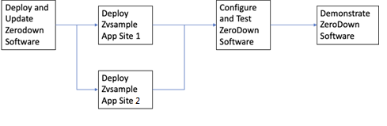

**ZeroDown Quick Start Process**

This ReadMe file and Quick Start Package will take you through the steps
required to:

1.  Install and setup the ZeroDown Software on Azure Stack;

2.  Deploy a sample customer application on two sites;

3.  Demonstrate the HA for Azure Stack solution as a proof of concept
    for your client.

The process flow to get everything up and running is as follows:

image:: ./media/image1.png
  :height: "1.65625in"
  :width: "5.0958333333in"

{width="5.095833333333333in" height="1.65625in"}

**Getting Started**

This Quick Start package provides access to:

-   **Quick Start Videos** that walk through the steps to get the
    ZeroDown Software and ZenVault sample customer application set up
    for testing and demonstration purposes.

-   **QuickStart Training** to deploy, configure, and then to
    demonstrate the HA solution in active/active mode across two
    separately located sites.

**Quick Start Videos**

YouTube reference video links are listed in Blue below.

-   **QS1-Deploy-ZeroDown \[Time 10m:38s)\
    **QS Video to deploy ZDS in an Azure Stack Environment

> <https://youtu.be/9b1ue2kw8Ds>

-   **QS2-ZVSample-Deployment \[Time 9m:06s\]\
    **QS Video to install ZenVault Sample application, test connections,
    and login

> <https://youtu.be/rBEqdvCI-tE>

-   **QS3-Config-ZeroDown \[Time 7m:22s\]\
    **QS Video to configure ZeroDown Software

> <https://youtu.be/89AoizhNrm4>

-   **QS4-Demonstration.mp4 \[Time 11m:06s\]**

> QS Video to walk through a typical demo of ZeroDown Software
>
> <https://youtu.be/uxCNsJ0eLJU>

**License**

Copyright 2019 © ZeroDown® Software
